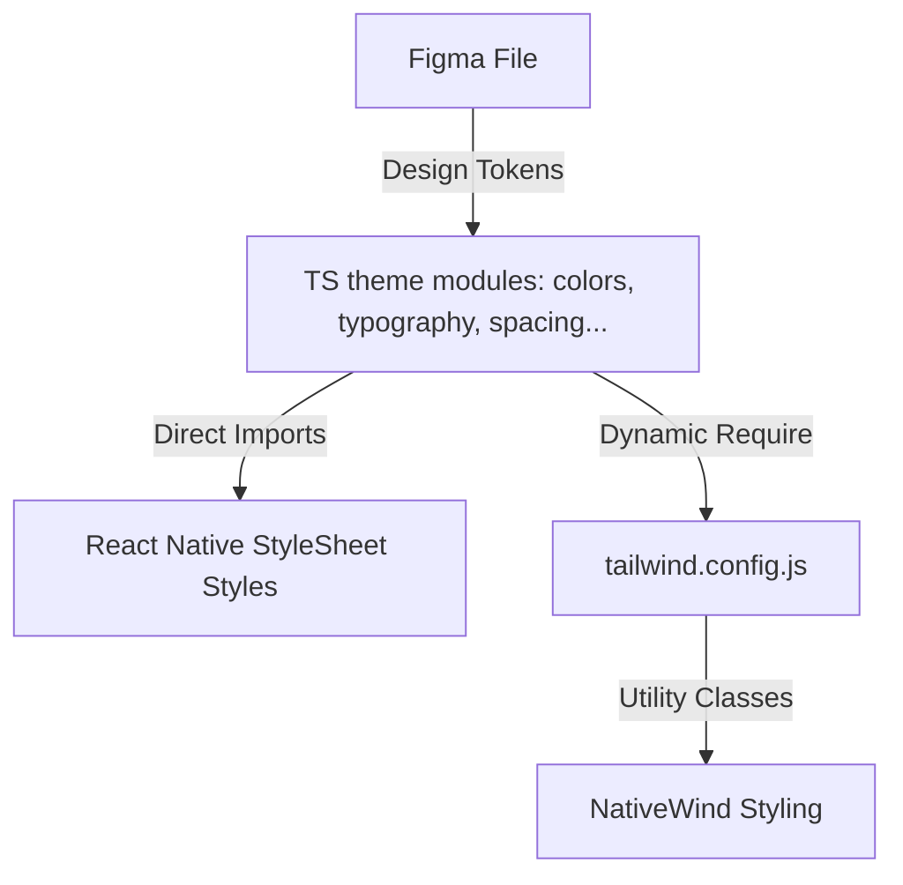

# HomePal Theme Developer Guide

A concise guide to understanding and using HomePal's Design Foundation tokens.

---

## 1. Project Theme Architecture



Our styling architecture relies on a **single source of truth** located in `src/theme/`. Both Nativewind (Tailwind CSS) and inline TypeScript StyleSheets consume these same design tokens dynamically.

---

## 2. Folder Purpose (`src/theme/`)

- [colors.ts](file:///d:/ITI%209%20Months/Graduation/HomePal/HomePal-Mobile/src/theme/colors.ts): Holds `brand`, `surface`, and `text` palettes.
- [typography.ts](file:///d:/ITI%209%20Months/Graduation/HomePal/HomePal-Mobile/src/theme/typography.ts): Defines font family, weights, and scale styles.
- [spacing.ts](file:///d:/ITI%209%20Months/Graduation/HomePal/HomePal-Mobile/src/theme/spacing.ts): Defines 8px base spacing tokens.
- [radius.ts](file:///d:/ITI%209%20Months/Graduation/HomePal/HomePal-Mobile/src/theme/radius.ts): Defines border radius corner roundness tokens.
- [shadows.ts](file:///d:/ITI%209%20Months/Graduation/HomePal/HomePal-Mobile/src/theme/shadows.ts): Standard shadow style structures for iOS & Android.
- [index.ts](file:///d:/ITI%209%20Months/Graduation/HomePal/HomePal-Mobile/src/theme/index.ts): Entrypoint re-exporting modules and establishing Root navigation themes.

---

## 3. How to Import Theme Tokens

For standard styles (non-Tailwind), import directly from the `@/src/theme` entrypoint:

```typescript
import { colors, spacing, radius } from '@/src/theme';
```

---

## 4. How to Use Colors

Colors are separated into context-specific properties:

- **Direct Usage**:
  ```typescript
  const styles = StyleSheet.create({
    text: { color: colors.text.primary },
    badge: { backgroundColor: colors.brand.primaryContainer },
  });
  ```
- **NativeWind**:
  - `text-brand-primary` / `bg-brand-primary` / `bg-brand-primary-pressed`
  - `bg-surface-surface` / `bg-surface-background` / `border-surface-border`
  - `text-text-primary` / `text-text-secondary` / `text-text-disabled` / `text-text-inverse`

---

## 5. How to Use Typography

We use the **Cairo** font family.

- **Direct Usage** (destructuring typography style objects):
  ```typescript
  const styles = StyleSheet.create({
    title: {
      ...typography.styles.h2,
      color: colors.text.primary,
    },
  });
  ```
- **NativeWind**:
  - Apply Cairo using the `font-cairo` utility:
    `<Text className="font-cairo text-text-primary font-bold text-lg">Heading</Text>`

---

## 6. How to Use Spacing

We use an 8px base spacing scale.

- **Direct Usage**:
  ```typescript
  const styles = StyleSheet.create({
    container: {
      padding: spacing['spacing/16'],
      gap: spacing['spacing/8'],
    },
  });
  ```
- **NativeWind**:
  - Recommended (Hyphenated): `p-spacing-16`, `m-spacing-24`, `gap-spacing-8`
  - Slash format: `p-[spacing/16]`, `gap-[spacing/8]`

---

## 7. How to Use Border Radius

- **Direct Usage**:
  ```typescript
  const styles = StyleSheet.create({
    card: { borderRadius: radius.medium },
  });
  ```
- **NativeWind**:
  - `rounded-radius-small` (8px)
  - `rounded-radius-medium` (16px)
  - `rounded-radius-large` (24px)
  - `rounded-radius-full` (9999px)

---

## 8. How to Use the Theme with NativeWind

NativeWind compiles your Tailwind classes into React Native compatible styles. Standard layout utilities are fully linked to the theme config:

```tsx
import { View, Text } from 'react-native';

export function PantryListItem() {
  return (
    <View className="gap-spacing-8 rounded-radius-medium border border-surface-border bg-surface-surface p-spacing-16">
      <Text className="font-cairo text-lg font-bold text-text-primary"> baladi bread </Text>
      <Text className="font-cairo text-text-secondary"> 20 loaves left </Text>
    </View>
  );
}
```

---

## 9. Best Practices

1. **Leverage Types**: Always rely on TypeScript's autocompletion by typing `colors.` or `spacing.` to prevent naming errors.
2. **Contextual Token Selection**: Choose the color based on its semantic category (e.g. use `colors.text.primary` for title texts, never a random hex or `colors.brand.primary` unless specifically highlighting brand branding).
3. **Arabic Support (RTL)**: Ensure margins/paddings use horizontal attributes (`marginHorizontal`, `paddingHorizontal`, or `mx-`, `px-` in Tailwind) instead of absolute Left/Right flags for natural RTL translation.

---

## 10. Things Developers Should Never Do

1. **NO Hardcoded Styling Constants**: Never write raw color hex codes (e.g., `#356859`) or numeric spacings directly in screens or components.
2. **NO Theme Configuration Duplication**: Never hardcode values inside `tailwind.config.js` or write independent CSS color schemes in `global.css`. Everything must read from `src/theme`.
3. **NO Modification of Root Tokens**: Never alter values inside the theme files (e.g., changing `#FAF8F3` directly) unless aligned with design system updates.
