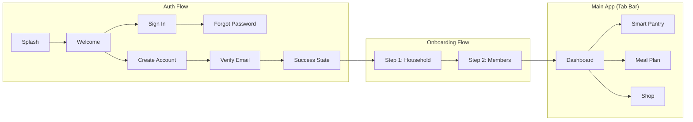

# HomePal — Complete Figma Design Analysis

> **Figma File**: [HomePal Design](https://www.figma.com/design/haAbETW7VJ7WhBJhaeL1M8/HomePal?node-id=2010-8)
> **Pages**: `Design System` (0:1) · `Screens` (2010:8)
> **Both light and dark theme variants are designed for every screen**

---

## 📱 Complete Screen Map (15 unique screens)

---

## 🔐 Auth Flow

### 1. Splash Screen

**Node**: `2047:464` (light) · `2047:409` (dark)

Centered HomePal logo mark (house icon with leaf) on warm background `#FAF8F3`.

---

### 2. Welcome Screen

**Node**: `2050:544`

| Element  | Details                                                                        |
| :------- | :----------------------------------------------------------------------------- |
| Header   | "HomePal" brand text                                                           |
| Hero     | Kitchen photo (mother & daughter)                                              |
| Headline | "Manage your home with ease."                                                  |
| Subtitle | "The calm way to handle groceries, meals, and budgets."                        |
| Actions  | **"Get started"** (primary filled) + **"I already have an account"** (outline) |

---

### 3. Sign In Screen

**Node**: `2017:60` (light) · `2052:782` (dark)

| Element     | Details                                                     |
| :---------- | :---------------------------------------------------------- |
| Logo        | HomePal icon + text                                         |
| Heading     | "Welcome back" / "Sign in to keep your household on track." |
| Auth Toggle | Segmented control: **Sign in** (active) / Create account    |
| Form        | Email field + Password field                                |
| Forgot Link | "Forgot password?" aligned right                            |
| Primary CTA | **"Sign in"** full-width button (56px)                      |
| Divider     | "or continue with"                                          |
| Social      | **"Continue with Google"** button with Google icon          |
| Footer      | "New to HomePal? **Create account**"                        |

---

### 4. Create Account Screen

**Node**: `2050:585`

| Element     | Details                                               |
| :---------- | :---------------------------------------------------- |
| Heading     | "Join HomePal" / "Manage your household efficiently." |
| Auth Toggle | Sign in / **Create account** (active)                 |
| Form        | Full Name + Email Address + Password                  |
| Checkbox    | "I agree to the **Terms and Conditions**"             |
| Primary CTA | **"Create account"** (56px)                           |

---

### 5. Forgot Password Screen

**Node**: `2050:651`

| Element     | Details                                                              |
| :---------- | :------------------------------------------------------------------- |
| AppBar      | Back button ← + "HomePal"                                            |
| Heading     | "Forgot password?"                                                   |
| Description | "Enter your email and we'll send you a link to reset your password." |
| Form        | Email field                                                          |
| CTA         | **"Send reset link"** (56px)                                         |

---

### 6. Verify Email Screen

**Node**: `2050:691`

| Element      | Details                                                                |
| :----------- | :--------------------------------------------------------------------- |
| AppBar       | Back button ← + "HomePal"                                              |
| Illustration | Mail icon in concentric circles (brand primary)                        |
| Heading      | "Verify your email"                                                    |
| Description  | "We've sent a 4-digit code to your email. Enter it below to continue." |
| OTP Input    | 4 digit boxes (64×64px each)                                           |
| CTA          | **"Verify"** (56px)                                                    |
| Footer       | "Didn't receive the code? **Resend code**"                             |

---

### 7. Success State Screen

**Node**: `2050:746`

| Element      | Details                                               |
| :----------- | :---------------------------------------------------- |
| Illustration | Checkmark in concentric circles (brand primary)       |
| Heading      | "You're all set!"                                     |
| Description  | "Your account is ready. Let's set up your household." |
| CTA          | **"Get Started"** button                              |

---

## 🏠 Onboarding Flow

### 8. Step 1 — Household Setup

**Node**: `2017:117`

| Element            | Details                                                                         |
| :----------------- | :------------------------------------------------------------------------------ |
| Nav                | Back ← + Logo + "Step 1 of 2"                                                   |
| Progress           | 2-segment bar (50% filled)                                                      |
| Heading            | "Let's set up your household"                                                   |
| Subtitle           | "Two quick steps so HomePal can tailor budgets and meals to you."               |
| **Member Count**   | "How many people are we planning for?"                                          |
| Counter Tiles      | `1` `2` `3` (selected) `4` `5+` (60×56px tiles)                                 |
| Helper             | "You'll enter details for each member on the next step."                        |
| **Budget Section** | "Monthly grocery budget"                                                        |
| Budget Chips       | "Under 3,000 EGP" · "✓ 3,000–6,000" (selected) · "6,000–10,000" · "10,000+ EGP" |
| Custom Input       | "Or enter an exact amount" text field                                           |
| Footer CTA         | **"Continue"** (56px, full-width)                                               |

---

### 9. Step 2 — Member Profiles

**Node**: `2017:232`

| Element                | Details                                                                                               |
| :--------------------- | :---------------------------------------------------------------------------------------------------- |
| Nav                    | Back ← + Logo + "Step 2 of 2"                                                                         |
| Progress               | 2-segment bar (100% filled)                                                                           |
| Heading                | "Tell us about each member"                                                                           |
| Subtitle               | "3 people — tap a member to fill in their details."                                                   |
| **Member Accordions**  | Expandable cards per member                                                                           |
| Member 1 (expanded)    | Name, Age/Weight/Height row, Gender chips, Lifestyle chips (12 options), Allergies chips (12 options) |
| Member 2/3 (collapsed) | Header only with + expand button                                                                      |
| **AI Text Area**       | "✨ Anything else? - AI personalized" with placeholder                                                |
| Footer Helper          | "HomePal builds your personalized plan in seconds."                                                   |
| Footer CTA             | **"Generate my profile"** (56px)                                                                      |

#### Lifestyle Options

Vegetarian · Vegan · Keto · Halal · Pescatarian · Low-carb · Diabetic-friendly · Mediterranean · Paleo · High-protein · Kosher · Gluten-free

#### Allergy Options

Peanuts · Tree nuts · Gluten · Dairy · Shellfish · Eggs · Soy · Fish · Sesame · Wheat · Mustard · Sulphites

---

## 🏡 Main App Screens (Tab Bar)

### Bottom Navigation Bar

**4 tabs**: Home · Pantry · Meals · Shop

- Height: 74px
- Active indicator: pill-shaped background on active icon
- Labels: Cairo 12px Regular

---

### 10. Dashboard

**Node**: `2030:351`

| Section                 | Details                                                                                                                                   |
| :---------------------- | :---------------------------------------------------------------------------------------------------------------------------------------- |
| **Header**              | "Good morning" / "Sara's Home" + Avatar circle "S"                                                                                        |
| **Free Budget Hero**    | Green gradient card: "Free budget" / **"2,150 EGP"** / "available to spend this month"                                                    |
| **Savings Target**      | Card with "Savings target · 2026" / "8,400 / 15,000 EGP" + ↗56% badge + progress bar + "6,600 EGP to reach your goal"                     |
| **Quick Actions**       | 3 tiles: "Add expense" · "Scan item" · "Generate plan" (each with icon in circle)                                                         |
| **Recent Transactions** | Header with "See all" link + list of transactions: Carrefour (-420 EGP), Salary (+12,000 EGP), Pharmacy (-85 EGP), Electricity (-310 EGP) |
| **NavBar**              | Home (active) · Pantry · Meals · Shop                                                                                                     |

---

### 11. Smart Pantry

**Node**: `2030:456`

| Section              | Details                                                                                                                                                                                                                |
| :------------------- | :--------------------------------------------------------------------------------------------------------------------------------------------------------------------------------------------------------------------- |
| **AppBar**           | "My Pantry" / "42 items" + notification dot + settings                                                                                                                                                                 |
| **Category Chips**   | ✓All · Produce · Dairy · Meat · Grains (horizontal scroll)                                                                                                                                                             |
| **Grid (2 columns)** | PantryItemCards (169×144px each)                                                                                                                                                                                       |
| Card Examples        | Tomatoes (6 left, Fresh) · Milk (1.5L left, Expiring) · Chicken breast (800g, Fresh) · Basmati rice (2kg, Fresh) · Eggs (4 left, Low) · Onions (1kg, Fresh) · Greek yogurt (2 cups, Expiring) · Beef mince (500g, Low) |
| **FAB**              | "+ Scan barcode" floating button (bottom-right)                                                                                                                                                                        |
| **NavBar**           | Home · Pantry (active) · Meals · Shop                                                                                                                                                                                  |

#### Item Status Badges

- **Fresh** → green badge
- **Expiring** → orange/warning badge
- **Low** → red/warning badge

---

### 12. Meal Plan

**Node**: `2030:825`

| Section          | Details                                                                   |
| :--------------- | :------------------------------------------------------------------------ |
| **AppBar**       | "Meal plan" / "This week · AI generated" + notification dot               |
| **Day Scroller** | Mon 10 · **Tue 11** (active) · Wed 12 · Thu 13 · Fri 14 · Sat 15 · Sun 16 |
| **Day Header**   | "Tuesday's meals" + "↻ Regenerate" button                                 |
| **Breakfast**    | "✓ Allergy safe" badge + MealCard                                         |
| **Lunch**        | "✓ Allergy safe" badge + MealCard                                         |
| **Dinner**       | MealCard                                                                  |
| **NavBar**       | Home · Pantry · Meals (active) · Shop                                     |

#### Meal Card Structure

Each MealCard (350×319px) contains:

- "✨ AI pick" badge (top-left)
- Food image placeholder
- Meal name (e.g., "Foul & eggs", "Koshari for the family", "Grilled chicken & rice")
- Metadata: ⏱ time · 👥 people · 💰 cost (EGP)
- "Uses X items from your pantry" info pill
- **"View recipe"** button

---

## 🎨 Figma Design Variables (Complete Token Dump)

### Colors (Light Theme)

| Variable           | Value     |
| :----------------- | :-------- |
| `primary`          | `#356859` |
| `primaryActive`    | `#2A5347` |
| `primaryContainer` | `#DCEEE8` |
| `accent`           | `#D99A3D` |
| `accentContainer`  | `#F7E7CA` |
| `background`       | `#FAF8F3` |
| `surface`          | `#FFFFFF` |
| `surfaceVariant`   | `#F4F2EE` |
| `border`           | `#E4E0DA` |
| `text/primary`     | `#2D2A26` |
| `text/secondary`   | `#6D6862` |
| `text/disabled`    | `#A8A29B` |
| `text/inverse`     | `#FFFFFF` |
| `text/onAccent`    | `#2D2A26` |
| `status/error`     | `#D9534F` |
| `status/success`   | `#43A66F` |
| `status/warning`   | `#E6A33A` |
| `status/info`      | `#4F8EF7` |

### Colors (Dark Theme — from Figma variables)

| Variable                | Value     |
| :---------------------- | :-------- |
| `colors/background`     | `#171816` |
| `colors/surface`        | `#242523` |
| `colors/surfaceVariant` | `#30312F` |
| `colors/border`         | `#434540` |
| `colors/primary`        | `#63C39A` |
| `colors/accent`         | `#F1B452` |
| `colors/textPrimary`    | `#F6F5F3` |
| `colors/textSecondary`  | `#C8C5BF` |

### Spacing

`xs: 4` · `sm/8: 8` · `md/16: 16` · `lg/24: 24` · `xl: 32`

### Border Radius

`small: 8` · `medium: 16` · `large: 24` · `full: 9999`

### Shadows

| Token       | Definition                                                                              |
| :---------- | :-------------------------------------------------------------------------------------- |
| `tabShadow` | DROP_SHADOW (0, 4px, 4px) #00000040                                                     |
| `barShadow` | DROP_SHADOW (0, 4px, 16px) #0000001A                                                    |
| `navShadow` | DROP_SHADOW (0, 4px, 6px, -4px) #2D2A2624 + DROP_SHADOW (0, 10px, 15px, -3px) #2D2A2624 |

---

## 🔍 Key Findings vs. Current Code

| Aspect                 | Figma Design                                                                  | Current Code                         | Gap                                      |
| :--------------------- | :---------------------------------------------------------------------------- | :----------------------------------- | :--------------------------------------- |
| **Dark theme colors**  | Fully defined (`#171816`, `#242523`, etc.)                                    | Placeholder HSL values from template | ⚠️ Need to update                        |
| **Light theme colors** | Matches `src/theme/colors.ts`                                                 | ✅ Aligned                           | —                                        |
| **Typography**         | Cairo font, all scales                                                        | ✅ Defined but not loaded            | ⚠️ Cairo font not bundled                |
| **Screens**            | 15 unique screens designed                                                    | 0 implemented                        | 🔴 All screens need building             |
| **Components**         | Button, TextField, Chip, Checkbox, NavBar, AppBar, PantryCard, MealCard, etc. | Only Button, Text, Icon coded        | 🔴 Most missing                          |
| **Navigation**         | 4-tab bottom nav + Stack screens                                              | No navigation setup                  | 🔴 Needs implementation                  |
| **Figma node IDs**     | All documented above                                                          | —                                    | Available for `get_design_context` calls |

---

## 📋 Recommended Build Order

1. **Load Cairo font** (dependency for all screens)
2. **Build missing UI components**: TextField, Chip, Checkbox, Switch, NavBar, AppBar
3. **Set up navigation**: Auth Stack + Tab Navigator (Home/Pantry/Meals/Shop)
4. **Auth Flow screens**: Welcome → Sign In → Create Account → Verify → Success
5. **Onboarding screens**: Step 1 + Step 2
6. **Dashboard screen**
7. **Smart Pantry screen** (with PantryItemCard)
8. **Meal Plan screen** (with MealCard)
9. **Update dark theme** with proper Figma dark colors
